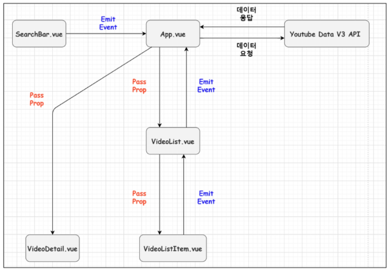
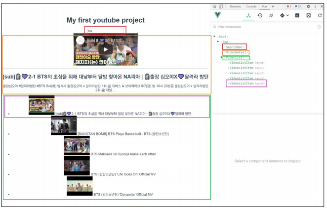
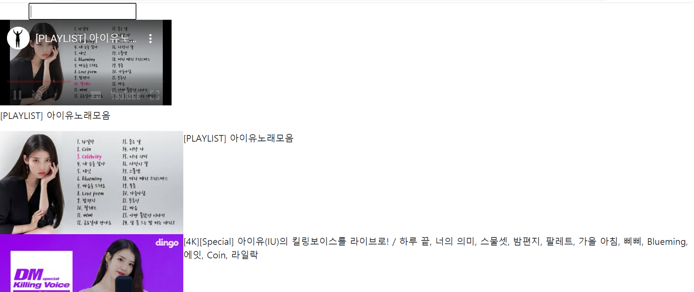
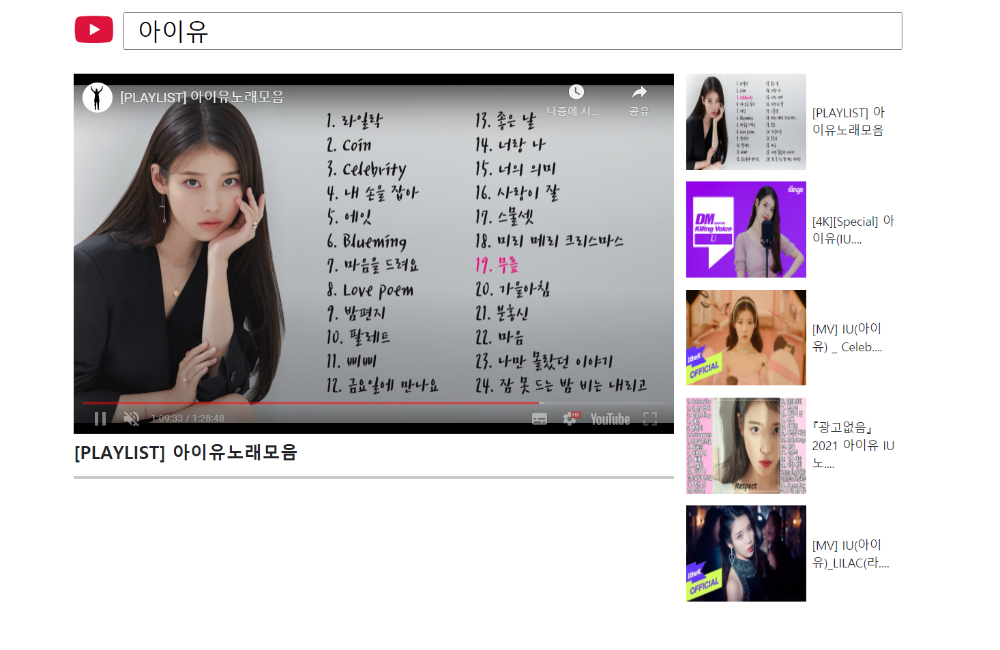

# Youtube

> homework는 props, emit만 이용해서 데이터를 전달했다.
>
> 이번 프로젝트는 vuex도 함께 이용해서 구현하고자 한다.

### 1. Structure (Homework)

### 2. Video and Thumbnail

### 3. CSS

#### 참고

- [**Bootstrap**](https://getbootstrap.com/)
- [**Font Awesome**](https://fontawesome.com/)

- [**이미지 transaction**](https://developer.mozilla.org/ko/docs/Web/CSS/CSS_Transitions/Using_CSS_transitions)

- [**Viewport**](https://velog.io/@pandati0710/CSS-viewport%EB%9E%80)